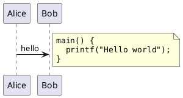
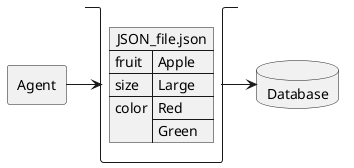
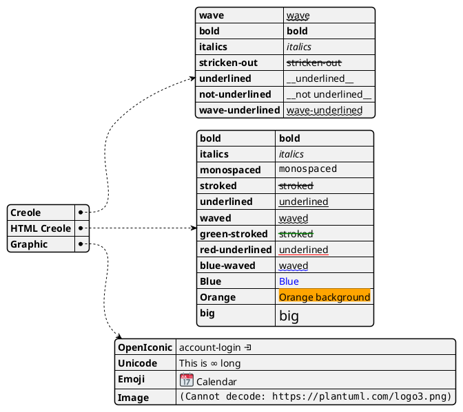

# fuzzyalgo.dev

## Setup fuzzalgo on your pc

### Dependencies

- forex MT5 ECN accounts from [roboforex.com](https://www.roboforex.com/)
- miniforge python (spyder and notebooks) on windows 64bit

### Create free MT5 demo ECN account at [roboforex.com](https://www.roboforex.com/)

- Forex Broker: [roboforex.com](https://www.roboforex.com/)
- Account type: MT5 DEMO ECN / hedge NO 
- MT5 Server:   RoboForex-ECN

### clone git repo

```bash

# test you access to github
ssh -T git@github.com
cd \<your-source-path>
# clone the directory
git clone git@github.com:fuzzyalgo/fuzzyalgo.git
# clone the data to train on
git clone git@github.com:fuzzyalgo/fuzzyalgo-data-rfx-2025-04.git
git clone git@github.com:fuzzyalgo/fuzzyalgo-data-rfx-2025-05.git
...

```

### install miniforge3 for windows 64bit

- [https://github.com/conda-forge/miniforge](https://github.com/conda-forge/miniforge)

```bash
https://github.com/conda-forge/miniforge
https://github.com/conda-forge/miniforge/releases/latest/download/Miniforge3-Windows-x86_64.exe

Start Windows Command Prompt:

> wget https://github.com/conda-forge/miniforge/releases/latest/download/Miniforge3-Windows-x86_64.exe -o Miniforge3-Windows-x86_64.exe
> start /wait "" Miniforge3-Windows-x86_64.exe /InstallationType=JustMe /RegisterPython=1 /S /D=%UserProfile%\Miniforge3
> del Miniforge3-Windows-x86_64.exe

    Please update conda by running
        $ conda update -n base -c conda-forge conda

```

### setup fuzzyalgo as linux conda env fuzzyalgo-py313


```bash
$ cd \<your-source-path>\fuzzyalgo
$ conda create -n fuzzyalgo-py313  nb_conda spyder numpy scipy pandas matplotlib sympy cython  python=3.13
$ conda activate fuzzyalgo-py313
# https://github.com/TA-Lib/ta-lib-python
$ conda install -c conda-forge ta-lib
$ conda install -c conda-forge libta-lib
# https://ta-lib.org/install/#linux-build-from-source
# $ wget https://github.com/ta-lib/ta-lib/releases/download/v0.6.4/ta-lib-0.6.4-src.tar.gz
$ cd install
$ tar -xvf ./install/ta-lib-0.6.4-src.tar.gz
$ cd ta-lib-0.6.4
$ ./configure -prefix=/usr
$ make 
$ sudo make install
$ sudo ldconfig
$ python 
>>> import talib
$ cd ..
$ rm -Rf ta-lib-0.6.4
$ cd ..
$ pip install filterpy scikit-fuzzy networkx pynput MetaTrader5
# do that later in wine python installation
# $ pip install MetaTrader5
$ python setup.py
$ conda deactivate
```


### setup fuzzyalgo as conda env fuzzyalgo-py313

- run "Miniforge Prompt" or "Miniforge Powershell" as Administrator (admin previledges for creating symlinks)

```PowerShell
> cd \<your-source-path>\fuzzyalgo
> conda create -n fuzzyalgo-py313  nb_conda spyder numpy scipy pandas matplotlib sympy cython  python=3.13
> conda activate fuzzyalgo-py313
> pip install filterpy scikit-fuzzy networkx pynput MetaTrader5
> pip install .\install\ta_lib-0.6.3-cp313-cp313-win_amd64.whl
> pip install psutil  
> python setup.py
> conda deactivate

# download ta-lib wheels for windows:
# https://github.com/cgohlke/talib-build?tab=readme-ov-file
# https://github.com/cgohlke/talib-build/releases
```

```bash
(base) C:\Windows\system32>cd \<your-source-path>\fuzzyalgo
(base) \<your-source-path>\fuzzyalgo>
(base) \<your-source-path>\fuzzyalgo> conda create -n fuzzyalgo-py313  nb_conda spyder numpy scipy pandas matplotlib sympy cython  python=3.13
(base) \<your-source-path>\fuzzyalgo> conda activate fuzzyalgo-py313
(fuzzyalgo-py313) \<your-source-path>\fuzzyalgo>
(fuzzyalgo-py313) \<your-source-path>\fuzzyalgo> pip install filterpy scikit-fuzzy networkx pynput MetaTrader5
(fuzzyalgo-py313) \<your-source-path>\fuzzyalgo> pip install .\install\ta_lib-0.6.3-cp313-cp313-win_amd64.whl
(fuzzyalgo-py313) \<your-source-path>\fuzzyalgo> python setup.py
	Run: win-64bit in conda env:  fuzzyalgo-py313
	dir_py_lib:  \<your-miniforge3-path>\miniforge3\envs\fuzzyalgo-py313\Lib
	dir_cwd:     \<your-source-path>\fuzzyalgo
	dir_script:  \<your-source-path>\fuzzyalgo
	name_user:   <your-username>
	name_host:   <your-hostname>
	mt5-server:  RoboForex-ECN
(fuzzyalgo-py313) \<your-source-path>\fuzzyalgo> conda deactivate
(base) \<your-source-path>\fuzzyalgo>
```

### populate cf_accounts_\<your-username\>@\<your-hostname\>.json with MT5 login and password

- template:
```bash
\<your-source-path>\fuzzyalgo\MetaTrader5_TMPL\config_RoboForex-ECN\cf_accounts.tmpl
```

- original:
```bash
\<your-source-path>\fuzzyalgo\MetaTrader5_TMPL\config_RoboForex-ECN\cf_accounts_<your-username>@<your-hostname>.json
```

- links:
```bash
%APPDATA%\MetaTrader5_RF5D01\config\cf_accounts_<your-username>@<your-hostname>.json
%APPDATA%\MetaTrader5_RF5D02\config\cf_accounts_<your-username>@<your-hostname>.json
%APPDATA%\MetaTrader5_RF5D03\config\cf_accounts_<your-username>@<your-hostname>.json
%APPDATA%\MetaTrader5_RF5D04\config\cf_accounts_<your-username>@<your-hostname>.json
```

- note: config\*.json are excluded from git

```JSON
{
   "RF5D01":{
      "login" : 0,
      "password" : "your-password-here",
      "server" : "RoboForex-ECN",
      "portable" : "True"
   },
   "RF5D02":{
      "login" : 0,
      "password" : "your-password-here",
      "server" : "RoboForex-ECN",
      "portable" : "True"
   },
   "RF5D03":{
      "login" : 0,
      "password" : "your-password-here",
      "server" : "RoboForex-ECN",
      "portable" : "True"
   },
   "RF5D04":{
      "login" : 0,
      "password" : "your-password-here",
      "server" : "RoboForex-ECN",
      "portable" : "True"
   }
}
```

### run fuzzyalgo conda env fuzzyalgo-py313

#### run from 'Miniforge Prompt'

- start 'Miniforge Cmd Prompt' or 'Miniforge Powershell Prompt' 

##### spyder
```bash
> conda activate fuzzyalgo-py313
> cd \<your-source-path>\fuzzyalgo
> spyder 
> conda deactivate
```

##### jupyter notebook
```bash
> conda activate fuzzyalgo-py313
> cd \<your-source-path>\fuzzyalgo
> jupyter notebook
> conda deactivate
```

##### python
```bash
> conda activate fuzzyalgo-py313
> cd \<your-source-path>\fuzzyalgo
> python <your-python>.py
> conda deactivate
```

## re-install conda env fuzzyalgo-py313

```bash
# if activated, then deactivate first
> conda activate fuzzyalgo-py313
> cd \<your-source-path>\fuzzyalgo
> jupyter notebook
> conda deactivate
# remove the env
> conda env remove -n fuzzyalgo-py313
# re-install the env
> cd \<your-source-path>\fuzzyalgo
> conda create -n fuzzyalgo-py313  nb_conda spyder numpy scipy pandas matplotlib sympy cython  python=3.13
> conda activate fuzzyalgo-py313
> python --version
	Python 3.13.2
> pip install filterpy scikit-fuzzy networkx pynput MetaTrader5
> pip install .\install\ta_lib-0.6.3-cp313-cp313-win_amd64.whl
> python setup.py
> conda deactivate
```

#### https://stackoverflow.com/questions/36851746/jupyter-notebook-500-internal-server-error?rq=1

```bash
(fuzzyalgo-py313) >pip install --upgrade --user nbconvert
	Installing collected packages: mistune, nbconvert
	  WARNING: The scripts jupyter-dejavu.exe and jupyter-nbconvert.exe are installed in '%APPDATA%\Python\Python313\Scripts' which is not on PATH.
	  Consider adding this directory to PATH or, if you prefer to suppress this warning, use --no-warn-script-location.
	Successfully installed mistune-2.0.4 nbconvert-7.2.7

(fuzzyalgo-py313) > dir %APPDATA%\Python\Python313\Scripts

	Directory of %APPDATA%\Python\Python313\Scripts
	23/05/2023  20:09           108.421 jupyter-dejavu.exe
	23/05/2023  20:09           108.407 jupyter-nbconvert.exe
				   2 File(s)        216.828 bytes

(fuzzyalgo-py313) > copy %APPDATA%\Python\Python313\Scripts\Python\Python313\Scripts\jupyter-*.exe C:\apps\miniforge3\envs\fuzzyalgo-py313\Scripts
```


#### https://stackoverflow.com/questions/40114639/jupyter-conda-tab-an-error-occurred-while-retrieving-package-information/trackback/

```bash
jupyter serverextension disable nb_conda
jupyter serverextension enable nb_conda
conda install -c conda-forge nb_conda_kernels
```


#### TBD use it under linux

```bash

win
> pip install .\install\ta_lib-0.6.3-cp313-cp313-win_amd64.whl
> pip install MetaTrader5

linux
   https://pypi.org/project/ta-lib
   https://github.com/ta-lib/ta-lib-python
   https://ta-lib.org/
      $ pip install ta-lib

   https://pypi.org/project/MetaTrader5/
      from: MetaTrader5-5.0.4803-cp39-cp39-win_amd64.whl
      to:  MetaTrader5-5.0.4803-cp39-none-any.whl
      $ pip install .\install\MetaTrader5-5.0.4803-cp39-none-any.whl

linux links
   https://pypi.org/project/mt5linux/
      https://github.com/lucas-campagna/mt5linux
   https://pypi.org/project/mt5linux-tc/
      https://github.com/Traders-Connect/mt5linux-tc   
   https://medium.com/@asc686f61/use-mt5-in-linux-with-docker-and-python-f8a9859d65b1
      https://github.com/ASC689561/fx-tinny/
```


### getting started documentation tools

# plantuml with local renderer on windows
```

https://marketplace.visualstudio.com/items?itemName=jebbs.plantuml
- start CMD as admin and run the two commands:

@"%SystemRoot%\System32\WindowsPowerShell\v1.0\powershell.exe" -NoProfile -ExecutionPolicy Bypass -Command "iex ((New-Object System.Net.WebClient).DownloadString('https://chocolatey.org/install.ps1'))" && SET "PATH=%PATH%;%ALLUSERSPROFILE%\chocolatey\bin"

choco install plantuml

    ...

    Added C:\ProgramData\chocolatey\bin\dot.exe shim pointed to 'c:\program files\graphviz\bin\dot.exe'.
    graphviz may be able to be automatically uninstalled.
    The install of graphviz was successful.
        
    AdoptOpenJDKjre v16.0.1.901 [Approved]
    AdoptOpenJDKjre package files install completed. Performing other installation steps.
    The install of AdoptOpenJDKjre was successful.
    Deployed to 'C:\ProgramData\chocolatey\lib\adoptopenjdkjre'
    Downloading package from source 'https://community.chocolatey.org/api/v2/'
    Progress: Downloading plantuml 1.2025.2... 100%

    plantuml v1.2025.2 [Approved]
    plantuml package files install completed. Performing other installation steps.
    Java path: C:\Program Files\Eclipse Adoptium\jre-21.0.6.7-hotspot\bin
    Java args: -Dfile.encoding=UTF-8 -jar "C:\ProgramData\chocolatey\lib\plantuml\tools\plantuml.jar"
    Plantuml registered as plantuml
    Added C:\ProgramData\chocolatey\bin\plantuml.exe shim pointed to 'c:\program files\eclipse adoptium\jre-21.0.6.7-hotspot\bin\javaw.exe'.
    Added C:\ProgramData\chocolatey\bin\plantumlc.exe shim pointed to 'c:\program files\eclipse adoptium\jre-21.0.6.7-hotspot\bin\java.exe'.
    Creating desktop shortcuts
    The install of plantuml was successful.
    Software install location not explicitly set, it could be in package or
    default install location of installer.

    $ "C:\Program Files\Eclipse Adoptium\jre-21.0.6.7-hotspot\bin\java" -DPLANTUML_LIMIT_SIZE=4096 -Dfile.encoding=UTF-8 -jar "C:\ProgramData\chocolatey\lib\plantuml\tools\plantuml.jar" ./home_network.puml
    
    ...


```








